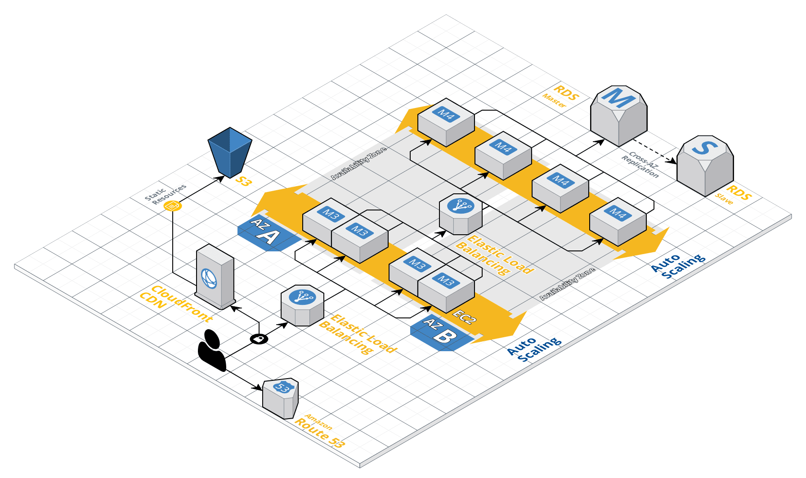

# Ranger-PI
[](https://twitter.com/@scottbraconnier)

Ranger-PI :)\*\*

---

## Philosophy

Serve others who have already served.

## Notes

we are excited to launch a new tutorial from the Ranger-PI dream team

## Target Audience

Returning Veterans - One at a time.

## Mission

Jumpstart their career back in the world.

## Tools

- React
- Bootstrap,
- Styled Components
- Conditional rendering
- Raspberry PI

Part of the `Bring your Pi` to Work day and making Fridays an opportunity to push learning to a new level.

### Supporting Our Returning Veterans, one at a time

## Architecture



Create React App is divided into two packages:

- `create-react-app` is a global command-line utility that you use to create new projects.
- `e-commerce` is the local stand-one application used for this training exercise.

`e-commerce/`<br/>
`..README.md`<br/>
`..node_modules/`<br/>
`..package.json`<br/>
`..public/`<br/>
`..index.html`<br/>
`..favicon.ic`<br/>
`...src/`<br/>
`......./components`<br/>
`......./Cart`<br/>
`..App.css`<br/>
`..App.js`<br/>
`..context.js`<br/>
`..data.js`<br/>
`..App.test.js`<br/>
`..index.css`<br/>
`..index.js`<br/>
`..logo.svg`<br/>
`..serviceWorker.js`<br/>

For the project to build, **these files must exist with exact filenames**:

- `public/index.html` is the page template;
- `src/index.js` is the JavaScript entry point.

## Available Scripts

In the project directory, you can run:

### `npm start`

Runs the app in the development mode. \*\*\*\*
Open [http://localhost:3000](http://localhost:3000) to view it in the browser.

The page will reload if you make edits.
You will also see any lint errors in the console.

### `npm test`

Launches the test runner in the interactive watch mode.
See the section about [running tests](#running-tests) for more information.

### `npm run build`

## Installing a Dependency

Finally, you will need to install some packages dependencies

```sh
npm install --save bootstrap
npm install --save react-paypal-express-checkout
```

## Importing a Component

This project setup supports ES6 and ES7 modules.
While you can still use `require()` and `module.exports`, we encourage you to use [`import` and `export`](http://exploringjs.com/es6/ch_modules.html) instead.

For example:

### `ButtonComponent.js`

```js
import React, { Component } from "react";

class ButtonComponent extends Component {
  render() {
    <div className="container">"special rules for your button"</div>;
  }
}

export default ButtonComponent; // Don’t forget to use export as default if the behavior is universal!
```

### `DangerButton.js`

```js
import React, { Component } from "react";
import Button from "./Button"; // Import a component from another file

class DangerButton extends Component {
  render() {
    return <Button color="red" />;
  }
}

export default DangerButton;
```

### Additional Components

Google Fonts:
Oswald
Permanent Marker
Font Awesome
Icon Finder
